# Add resource parameter values in Excel file

## Introduction

This is a continuation of the lab 1 : [Setup the CD3 toolkit](/cd3-automation-toolkit/Setup%20the%20Toolkit/setup_the_toolkit.md)

As a recap, in the previous lab we cloned the cd3 repo, built an image, executed the CD3 container and connected it to the OCI tenancy. 

Estimated time: 10 minutes

### Objectives

In this lab, you will:

- Add required parameter values for Compartments, VCN, Subnets, Compute, Block Volume, ATP in the Excel file.

### Prerequisites

- Please follow the previous lab till the last step. Once you are able to view the customer specific files in the outdirectory, you are all set to continue with this lab.

## Task 1:  Add required resource parameter values in the Excel file

### 1. **Identity**

1. Choose CD3-CIS-template from [CD3 Excel templates](https://oracle-devrel.github.io/cd3-automation-toolkit/latest/excel-templates/). 

    >**Note:** Any template other than *CD3-CIS-ManagementServices-template* can be used to provision these services.

2. Refer to the blue section in each worksheet to fill the resource details in proper formats. Not all fields are mandatory. 

    ```
    Please fill resources data before the <END> tag. Any data below the <END> tag will not be processed.
    ```

3. Add details for Compartment:

    - Open the *Compartments* tab and add your compartment data.

    - If the Parent compartment name is unique in the tenancy, provide its name directly. If the Parent compartment name is not unique, provide the compartment's hierarchial format as shown below. 
      
        ```Parentcompartment1::Parentcompartment2:: ... ::Parentcompartment n```

    >**Note:** Provide your Tenancy's "home region" under the "Region" column. (same for all OCI Identity components).
     
    Refer to the below image as example:
    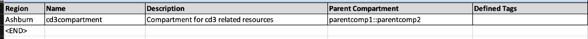 

### 2. **Network**

1. Add details for the VCN:

    - Navigate to *VCNs* sheet and create a VCN with the following details:

        >**Note:** For any resource, If Compartment name is unique within the tenancy, provide the compartment name as it is. 
        If Compartment name is not unique, provide it in this hierarchial format:                    ```parentcompartment1::parentcompartment2::child_compartment```

        - VCN Name: ```cd3vcn```, CIDR Blocks: ```10.110.0.0/24```

    Refer to the below image as example:

    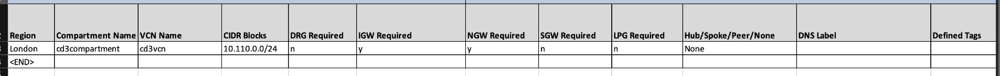

2. Add DHCP details for cd3vcn

    - Navigate to *DHCP* sheet and create DHCP Options with the following details:

        - VCN Name: ```cd3vcn```, DHCP option Name: ```dhcp-internal```, ServerType: ```VcnLocalPlusInternet```, Search domain: ```oci.com```

    Refer to the below image as example:

    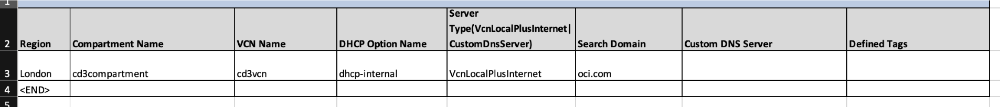

3. Add details for creating Subnets in cd3vcn

    - Navigate to *SubnetsVLANs* sheet and create subnets with the following details:

        - Subnet Name: ```subnet1```, Type: ```public```, CIDR Block: ```10.110.0.0/26```, Route table: ```RT1```, Security list: ```SL1```, Configure IGW Route: ```y```.

        - Subnet Name: ```subnet2```, Type: ```private```, CIDR Block: ```10.110.0.64/26```, Route table: ```RT2```, Security list: ```SL2```, Configure NGW Route: ```y```.

    Refer to the below image as example:

    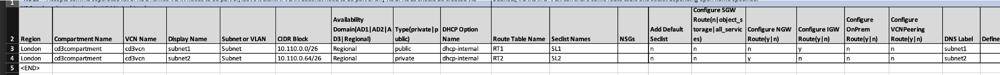

4. Add details for Route rules (Optional)

    - Navigate to *RouteRulesinOCI* sheet and create Route rules with following details:

        - Route Table Name: ```RT1```, Route Destination Object:```igw:cd3vcn_igw```, Destination type: ```CIDR_BLOCK```, Destination CIDR: ```0.0.0.0/0```
        - Route Table Name: ```RT2```, Route Destination Object:```ngw:cd3vcn_ngw```, Destination type: ```CIDR_BLOCK```, Destination CIDR: ```0.0.0.0/0```
    

    Refer to the below image as example:

    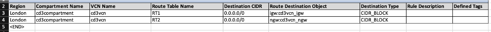

5. Add details for Security rules (Optional)

    - Navigate to *SecRulesOCI* sheet and create Security rules with following details:

        - SecList Name: ```SL1```, isstateLess: ```False```, Rule type: ```INGRESS```, protocol:```TCP```, Source: ```10.0.0.0/16```, Destination ports - ```22```

        - SecList Name: ```SL2```, isstateLess: ```False```, Rule type: ```INGRESS```, protocol:```TCP```, Source: ```10.0.0.0/16```, Destination ports - ```1521, 1522```

    Refer to the below image as example:

    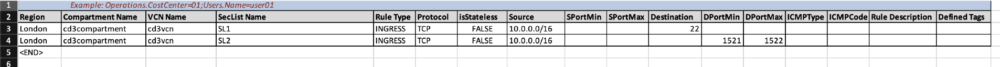

### 3. **Compute**

1. Add details for Compute VM

    - Navigate to *Instances* sheet and create a **always-free** Compute Instance with below details:

    
       - Display Name: ```cd3vm```, Network Details: ```cd3compartment@cd3vcn_subnet1```, source details: ```image::Linux```, shape: ```VM.Standard.E4.Flex::1```, ssh Key Var Name: ```ssh_public_key```    
    
       - To add SSH key to login to the vm, place it in the variables_<region\>.tf file under ssh_public_key variable. 

        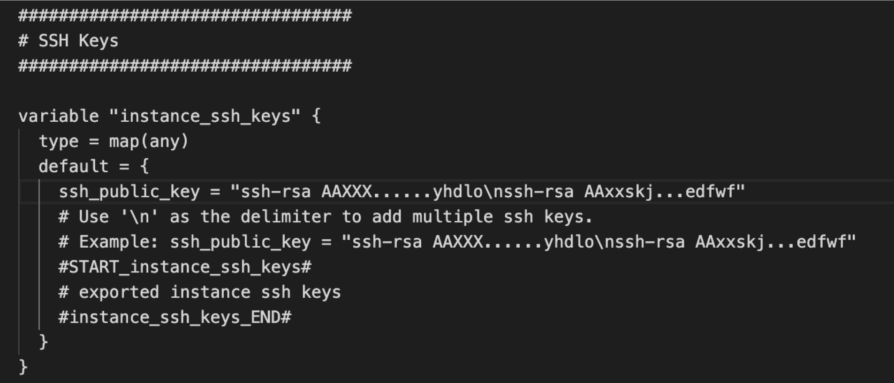

       >**Note:**   
           - To create the VM with a custom image, in Instances sheet add the source details value as ```image::<imageocid_variablename>```. Add this variable name under instance_source_ocids variable and assign your image ocid as its value. 

        Check Below image for example:

        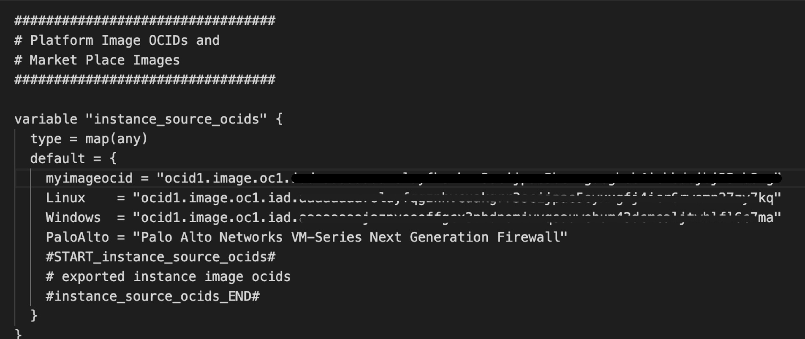


        

2. Creating a simple web application

    - Create an extra column named ```Cloud Init Script``` in the *Instances* sheet and enter its value as "web.sh" in the same row with cd3vm instance details.

    - Create bash file "web.sh" under below path and copy below sample script to enable Apache on the VM.
    
    ```
    /cd3user/tenancies/<prefix>/terraform_files/<region_name>/compute/scripts/
    ```

    ```
    <copy>
     #!/bin/bash
     sudo yum install -y httpd
     sudo systemctl enable httpd
     sudo systemctl restart httpd
     sudo systemctl stop firewalld
     sudo systemctl disable firewalld
     sudo iptables -A INPUT -p tcp --dport 80 -j ACCEPT
     sudo iptables-save
    </copy>
    ```
 
    >**Note:** Check logs under /var/lib/cloud/instance to ensure correct data was passed.

    Refer to the below image as example:
    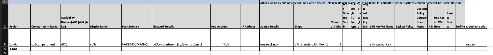

3. Add details for Block Volumes

    - Navigate to *Block Volumes* sheet and create a Block Volume with below details:

    
       - Block Name: ```cd3blockvolume```, VPUs per GB: ```20```,  size in GBs: ```150```, Attached to instance: ```cd3vm```, Atatch Type: ```paravirtualized```
    

    Refer to the below image as example:

    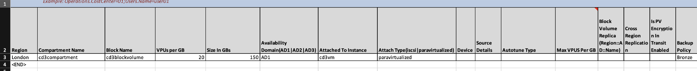

### 4. **Database**

1. Add details for ATP 

    - Navigate to *ADB* sheet and create an **always-free** ATP service with the below details:
    
       - ADB Display Name: ```cd3-ATP```, Network Details: ```cd3compartment@cd3vcn_subnet2```, DB Name: ```adb123db```, CPU Core Count: ```1```, Data Storage Size in TB: ```0.02```, License model: ```LICENSE_INCLUDED```
    

    Refer to the below image as example:

    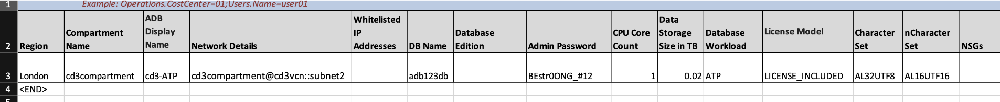

Once all the resource details are filled, save the Excel file. 

In this lab, we have learnt how to enter details in the CD3 Excel templates.

You may now __proceed to the next lab__.

## Acknowledgements

- __Author__ - Dipesh Rathod
- __Contributors__ - Murali N V, Suruchi Singla, Lasya Vadavalli
- __Last Updated By/Date__ - Dipesh Rathod, Mar 2024
