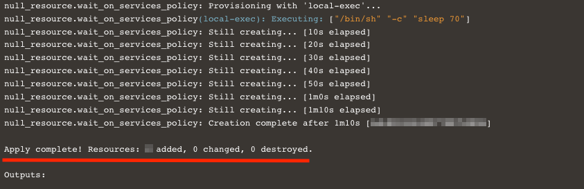

# Deploy OCI resources using CD3 Toolkit - CLI

## Introduction

This is a continuation of the lab 2 : [Add resource parameters values in excel file](/cd3-automation-toolkit/add-resource-values-excel/add-resource.md)

As a recap, in the previous lab we added resource parameters values in excel file for Compartments, VCN, Subnets, Compute, Block Volume and ATP.

Estimated time: 10 minutes

### Objectives

In this lab, you will:

- Execute the *setUpOCI.py* script to generate terraform files.
- Execute terraform commands from the respective service folders. 

### Prerequisites

- Please follow the previous lab till the last step. Once you are ready with excel template. You are all set to continue with this lab.

# Create Resources using CLI 

## Task 1: Add Excel path to 'prefix_setUpOCI.properties'
    
    Note: Please check the tenancyconfig.properties file for prefix information

1. Add the previously filled Excel file under any location inside the container. 

2. Open below file

    ```
    /cd3user/tenancies/<prefix>/<prefix>_setUpOCI.properties
    ```
3. Add the Excel file path under ```cd3file``` parameter. 

4. Set ```workflow_type``` to *create_resources*, since we are creating new resources.
    
5. Save the file.


## Task 2: Execute setUpOCI.py

1. 
     >**Note:**
     setUpOCI.py script generates the Terraform files for the resources.

    To run setUpOCI.py script, Navigate to below path and execute the command.
        
    ```
    cd /cd3user/oci_tools/cd3_automation_toolkit/
    python setUpOCI.py /cd3user/tenancies/<prefix>/<prefix>_setUpOCI.properties
    ```

## Task 3: Generate terraform files and create our resources in OCI

1. Select option 1 from *setUpOCI.py* output menu. 

    ```Identity--> 1: Add/Modify/Delete Compartments```

     >**Note:** Since we are creating all resources in the *cd3compartment*, we should first create the compartment in OCI and run fetch compartments again. This way the variables file has the *compartment* entry and other resources can be created in it.


2. Navigate to identity directory under home region directory after Terraform files are created.

    ```               
    cd /cd3user/tenancies/<prefix>/terraform_files/<home_region>/identity
    ```

3. Execute below commands in sequence to create the compartment.
    ```
       terraform init
       terraform plan 
       terraform apply
    ```
     
   
4. Navigate back to the ```/cd3user/oci_tools/cd3_automation_toolkit/``` folder and execute the ```setUpOCI.py``` again as shown in *Task 2* and select *fetch compartments*.


    >**Note:** This option will update OCID of newly created compartments in TF file.

5. Select: 4,7,8,9 options to create terraform files for Network, Compute, Storage and Database respectively from the *setUpOCI.py* output menu.

    - Under *Network*: Select- Options 1
    - Under *Compute*: Select- Option 2
    - Under *Storage*: Select- Option 1
    - Under *Database*: Select- Option 3

    >**Note:** Terraform files are generated under the respective Service directories of the Region directory.

6. Once the Terraform files are generated from above step, navigate to below path for each of the services: Network, Compute, Database and Block volume.

    ```
    /cd3user/tenancies/<prefix>/terraform_files/<region>/<service_folder>
    ```

7. Enter into each of the required service folders (network, compute, database) and execute the below terraform commands to provision the resources in OCI.

    ```
    terraform init
    terraform plan 
    terraform apply 
    ```

8. Review the terraform output and verify the provisioned resources on OCI console.

    

In this lab, we have learnt how to execute setUpOCI.py to create terraform files and create OCI resources using those terraform files.

You may now __proceed to the next lab__.

## Acknowledgements

- __Author__ - Lasya Vadavalli
- __Contributors__ - Murali N V, Suruchi Singla, Dipesh Rathod
- __Last Updated By/Date__ - Dipesh Rathod, Mar 2024
