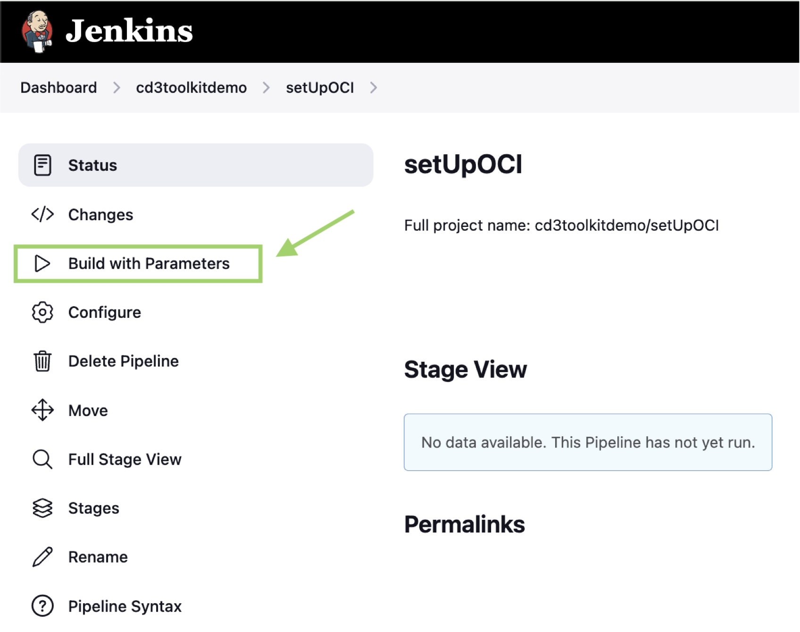
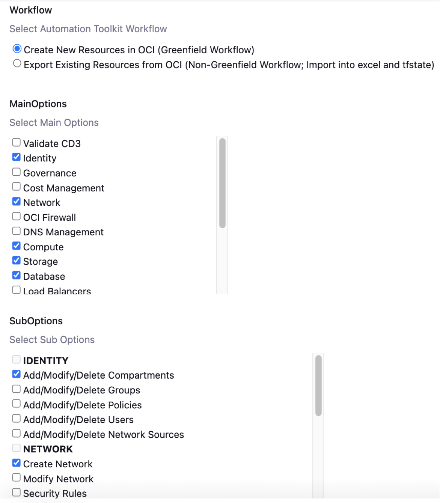
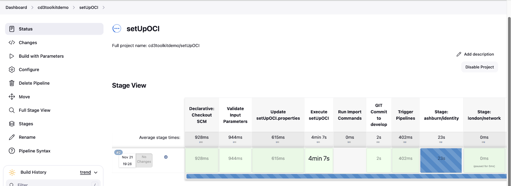
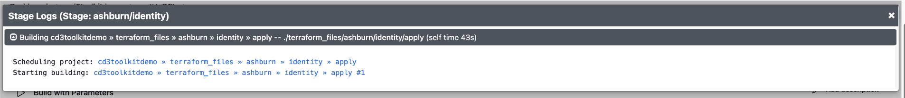
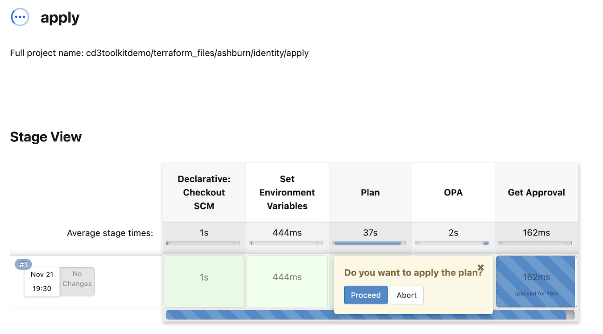

# Deploy OCI resources using CD3 Toolkit - Jenkins

## Introduction

This is a continuation of the lab 2 : [Add resource parameters values in excel file](/cd3-automation-toolkit/add-resource-values-excel/add-resource.md)

As a recap, in the previous lab we added resource parameters values in excel file for Compartments, VCN, Subnets, Compute, Block Volume and ATP.

Estimated time: 10 minutes

### Objectives

In this lab, you will:

- Execute setUpOCI and terraform pipelines from jenkins.
- Review terraform plan, OPA output and approve terraform apply stage.

### Prerequisites

- Please follow the previous lab till the last step. Once you are ready with excel template. You are all set to continue with this lab.

# Create Resources using Jenkins
   
   >**Note:** Only one user at a time using the Jenkins setup is supported in the current release of the toolkit.

## Task 1: Add Excel path to 'prefix_setUpoci.properties'
1. **Login** to Jenkins URL with the user created after initialization.
2. **Click** on Prefix Name from Dashboard
3. **Click** on setUpOCI pipeline. 
4. **Click** on **Build with Parameters** from left side menu.

        

5. **Upload** the previously filled Excel sheet in Excel_Template section.
    
        

## Task 2: Execute setUpOCI.py

1. Select the workflow as *Create Resources in OCI (Greenfield Workflow)*. Choose single or multiple MainOptions as required and then corresponding SubOptions. For the scope of this lab, select below options.

    ```
    Under MainOptions select --> Identity, Network, Compute, Storage, Database

    Under SubOptions select corresponding options:
    Identity --> Add/Modify/Delete Compartments
    Network  --> Create Network
    Compute  --> Add/Modify/Delete Instances/Boot Backup Policy
    Storage  --> Add/Modify/Delete Block Volumes/Block Backup Policy
    Database --> Add/Modify/Delete ADBs

   ```
   Check below example screenshot.

      

2. Click on **Build** at the bottom.

## Task 3: Generate terraform files and create resources in OCI

   1.  After above step, setupoci pipeline's stages start executing. The **Execute setUpOCI** stage  will execute the setupoci python script to generate terraform auto.tfvars files. These tfvars files are then committed to the OCI Devops GIT Repo develop branch.

   2.  This is how the setupoci pipeline looks like. 

           

   3. Review the stage logs for each service by clicking on each service and then **Logs**. From the logs, click on the link to terraform "apply" pipleine. This is how the stage logs look like.

           
        

   4. From each terraform "apply" pipeline, **Review Logs** for Terraform Plan and OPA stages by clicking on the stage and then **Logs**.
    
   5. Click **Proceed** to proceed with terraform apply or **Abort** to cancel the terraform apply.

          

        >**Note:** Get Approval stage has timeout of 24 hours, if no action is taken the pipeline will be aborted after 24 hours.        

   6. **Login** to the OCI console and **verify** that resources got created as required.

In this lab, we have learnt how to execute setUpOCI.py to create terraform files and create OCI resources using those terraform files.

You may now __proceed to the next lab__.

## Acknowledgements

- __Author__ - Dipesh Rathod
- __Contributors__ - Murali N V, Suruchi Singla, Dipesh Rathod
- __Last Updated By/Date__ - Dipesh Rathod, Mar 2024
